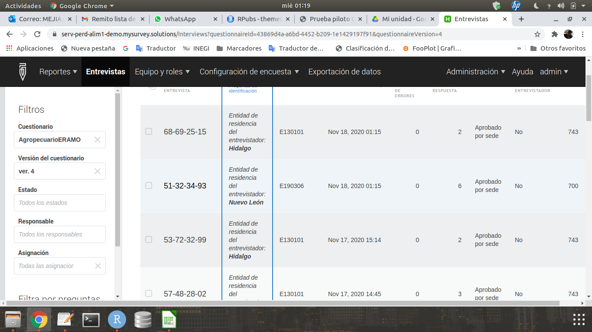
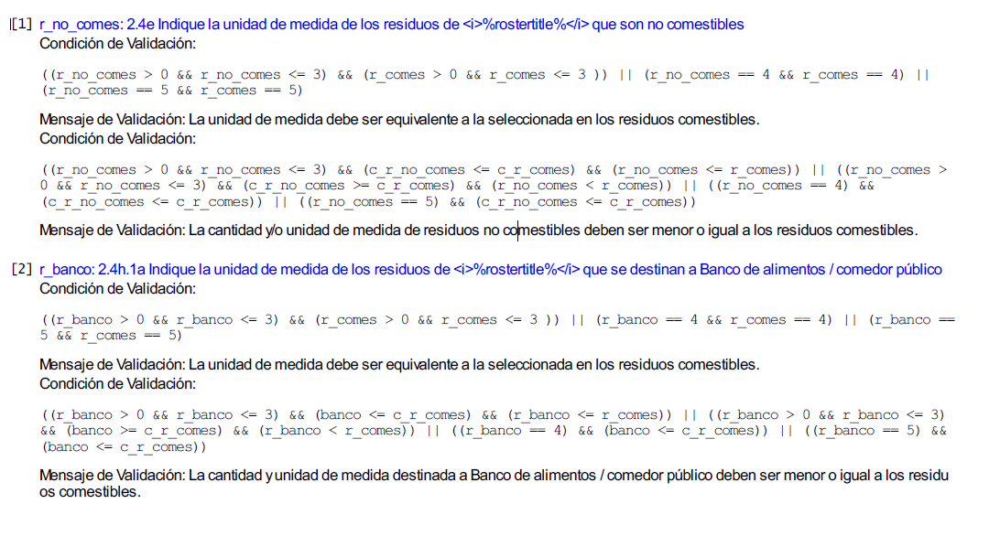

---
title: "**Metodología**"
--- 

<div class=text-justify>

<br>
 

Como puede observarse del apartado anterior, se ha dispuesto de un conjunto de tablas descargadas de la plataforma *Survey Solutions*, que se descargan en una carpeta denominada *bd_captura*. A esta versión de la base de datos de captura, que aún se encuentra sin depurar, se le aplicarán los tratamientos de validación y procesamiento que se describen más adelante y que dan origen a una nueva versión de la base de datos lista para su explotación, y que se aloja en una nueva carpeta denominada *bd_explot*.

Se tienen también las tablas en formato **csv** que fueron el resultado de ir construyendo previo al operativo, los listados de entrevistadores, coordinadores grupos de capacitación, así como las descripciones de las asignaciones a los servidores, claves de acceso, datos telefónicos, etc. Estas tablas se encuentran en una carpeta denominada *bd_operativa*.

Con las tablas depuradas de las carpetas *bd_explot* y *bd_operativa*, se construyó una base de datos en SQLite. Con SQLite se fueron importando todas estas tablas *csv* e integrándolas en una base de datos llamada **pp_eramo2020.db**. El detalle de la descripción de esta base de datos "completa" (FD), se incluye más adelante.  

La construcción de la base de datos *pp_eramo2020.db* obedece más a un aspecto formal de conceptualizarla como la base de datos *integrada* del proyecto, que a una necesidad real para la generación de resultados. Como se verá más adelante, para efectos de explotación y generación de indicadores y datos, resulta poco práctico recurrir a dicha base de datos formal, pues no es con SQL que se desarrollan los cálculos y elaboran los resultados, sino con R, a partir de las propias tablas *csv* que se tienen en *bd_explot*, para generar todos los cálculos necesarios.

R, y desde luego Python, presentan muchas más potencialidades estadísticas y herramientas para generar resultados rápidos y atractivos en forma gráfica o tabular (elementos dinámicos), así como mapas interactivos. Para esto último se han empleado las potencialidades de R como software para gestión de sistemas de información geográfica (SIG) mediante el desarrollo de mapeo usando herramientas de desarrollo abiertas como OpenStreetMap, a través de la librería *leaflet*. 

Hacia el final, sólo para ejemplificar el uso de SQL se realizan y muestran algunas consultas posibles desde la base de datos *pp_eramo2020.db*.

Un aspecto importante a considerar es que que, dado el escaso tiempo con que se contó para realizar este procesamiento y obtención de resultados, de acuerdo con los tiempos del levantamiento ya referidos respecto a la fecha de entrega del proyecto, ha sido necesario generar una vista limitada de la base de datos de captura, con fecha del 15 de noviembre, a efecto de tener tiempo para generar algunos indicadores representativos de interés para la encuesta, así como algunas consultas, gráficas y mapas para complementar el presente reporte web de resultados.

La salida del reporte del proyecto se hace con la libreria *RMarkdown*. A efecto de presentar un reporte que pueda incluir elementos dinámicos, se pensó en una salida en formato *html* en forma de un micrositio web (bookdown), en lugar de la tradicional salida a pdf, que por otra parte al ser estática no permite visualizar elementos dinámicos como se muestran aquí.

Por otra parte, dado que este proyecto se pretende construir bajo la filosofía de [*investigación reproducible*](https://book.fosteropenscience.eu/es/02OpenScienceBasics/04ReproducibleResearchAndDataAnalysis.html){target=_blank_}, así como para cumplir con las expectativas de transparencia que la normativa institucional demanda, se entrega al final no sólo el sitio *html* final, sino todo el código con el que se construye, así como la carpeta de materiales y base de datos que le dieron origen.

Lo anterior permitirá a quien revise el proyecto reproducir completamente los resultados descritos en el reporte. Esta es precisamente la idea: aumentar el rigor y la calidad de los trabajos y, por tanto, incrementar la confianza en los resultados bajo altos estándares de integridad. Se trata de una filosofía de desarrollo basada en compartir conocimientos y experiencias con otros, en la búsqueda de crear redes de participación colaborativa útiles para todos.

Por lo demás, la metodología del procesamiento y explotación se irá relatando conforme se avance a dichos apartados.

<br>
<br>

## Consideraciones importantes sobre la Base de Datos.

<br>

Es menester aclarar en este apartado algunas consideraciones a tomar en cuenta respecto a las acotaciones que este análisis presenta para el proyecto.

1. Como ya se mencionó, fue necesario realizar un corte de lo recabado en la base de datos del levantamiento al día 15 de noviembre del presente, ya que el periodo de captación de datos en campo se prolongará hasta el 27 de noviembre. Esto para poder contar con algunos datos de entrevistas reales y tener un tiempo suficiente (una semana al menos) para poder elaborar este reporte y entregar aunque sea algunos resultados parciales del mismo. En todo caso, se dispondrá de una vista aproximada de lo que será el levantamiento completo.

2. Para efecto de simplificar el análisis, únicamente he descargado de la base de datos de captura las entrevistas realizadas en el estado de Aguascalientes, pues no deseo mostrar resultados mucho más dispersos a nivel regional o nacional, sino en todo caso poder mostrar mapas más concentrados de establecimientos en una región donde se pueden visualizar mucho mejor, debido a su cercanía entre sí.

3. De los dos tipos de cuestionarios: de unidades agropecuarias y de establecimientos, he elegido mostrar los resultados de este último, ya que son los más numerosos. Es necesario aclarar que si bien se cuenta con cuestionarios de la parte agropecuaria, son mucho más escasos, debido a la poca respuesta de los informantes en las zonas agrícolas. Por ello, y para efectos de poder mostrar ciertos indicadores, he preferido usar una muestra de lo captado en establecimientos que es más numerosa. El filtrado de estos cuestionarios se hace también directamente en el administrador del servidor de Survey Solutions.

<br>


```{r resumen, fig.align='center', out.width= '95%', echo=FALSE, cache=TRUE, fig.cap="**Vista del servidor de la plataforma Survey Solutions**"}



```

<br>
<br>
<br>

## Definición de la muestra.

<br>

Se definió una muestra que incorporara las clases de actividad relacionadas con alimentos, tomando como base el Directorio Estadístico Nacional de unidades de observación (DENUE). Con base en ello, se hizo una muestra de 106 unidades económicas fijas para el estado de Aguascalientes que se presenta a continuación. 

Cabe aclarar que adicionalmente a la muestra, se captaron hasta el momento del corte 31 establecimientos semifijos o ambulantes relacionados con alimentos.

<br>

```{r tab106, echo=FALSE, fig.align='left', warning=FALSE}

library(DT)
tab106 <- read.csv("bd_pp_eramo2020/procesamiento/bd_operativa/muestra.csv", header=T)
names(tab106) <- c("Id_denue","Nombre del establecimiento","Codigo SCIAN","Número de personas ocupadas","Municipio","Tipo de unidad económica","Sector SCIAN","Tipo de actividad","Entrevistador Asignado")
DT::datatable(tab106, filter = 'top', options = list(
  pageLength = 3, autoWidth = TRUE, scrollX = TRUE,
  fixedColumns = TRUE, language = list(
    info = "Mostrando registros del _START_ al _END_ de un total de _TOTAL_ registros",
    paginate = list(previous = 'Anterior', `next` = 'Siguiente'),
    search =  "Buscar:", lengthMenu = "Mostrar _MENU_ registros" )
  ))

```


<br>
<br>

## Validación en línea del cuestionario.

<br>

Una de las grandes ventajas que proporcionó el uso de la plataforma del BM, fue la posibilidad de insertar dentro del instrumento de captación, validaciones básicas que aseguran la calidad de los datos desde la salida misma de captura. Específicamente, comprenden al menos 3 tipos de validaciones:

1) De secuencia lógica del cuestionario. Corresponden a las validaciones referentes al flujo de las preguntas, y comprenden los filtros y pases entre preguntas y secciones. La aplicación garantiza que al programarse dichos elementos, no pueda cerrarse la entrevista si existen errores de este tipo, por lo que el entrevistador puede corregir de inmediato cualquier situación indeseable al respecto.

2) Rangos válidos. El cuestionario electrónico garantiza que una variable no podrá contener un rango distinto de valores para lo que se programa. Esto excluye también la posibilidad de captar caracteres o tipos de datos ajenos a lo que se espera.

3) Validaciones especiales. El diseñador del cuestionario puede incluir validaciones adicionales relacionadas con aspectos lógicos o conceptuales de interrelación entre dos o más preguntas del cuestionario. Específicamente, para esta encuesta se construyeron validaciones para hacer consistentes las unidades de medida de los residuos declarados entre sí, de modo que si alguien declara una cantidad de residuos total, al momento de desglosar de ellos la cantidad no comestible, esta última no resulte mayor que la primera. También se verifica que si alguien declaró unidades en litros en una pregunta, no pueda declarar toneladas en otra, por ejemplo. 

Las expresiones para las condiciones de validación programadas en la plataforma fueron las siguientes:

<br>

```{r i1, fig.align='center', out.width= '95%', echo=FALSE, cache=TRUE}



```


<br>
<br>


</div>


