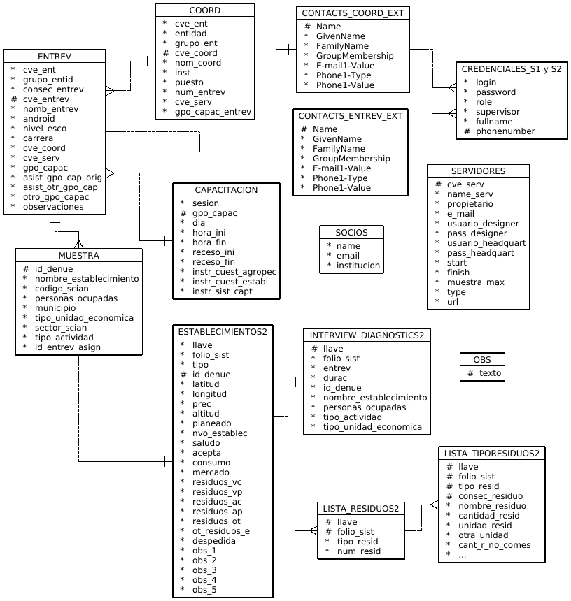

---
title: "**Procesamiento**"
--- 

<div class=text-justify>

<br>
<br>
 
# Descripción del tratamiento de la base de datos de captura, para obtener la base de datos de explotación

<br>


El objetivo de este apartado es describir el registro puntual de cada de una de las acciones realizadas para la preparación, validación e integración de la Base de Datos, desde la salida de captura, hasta la versión final, para su explotación y análisis.

<br>
<br>

## Descarga de la Base de Datos

<br>

La base de datos fue descargada de la plataforma de [*Survey Solutions*](https://mysurvey.solutions){target="_blank"} en formato SPSS (.sav). 

Debido a que no se cuenta con licencia de dicho software comercial, se convirtieron las tablas a formato *.csv*, empleando la aplicación *Stat/Transfer* (software libre).

Una vez descargadas las tablas, el procesamiento de las mismas se realizó completamente en el lenguaje de programación R, excepto en todas aquellas situaciones previas que se describen a continuación, en las que fue necesario hacer ligeros ajustes manuales a ciertos registros de la tabla *establecimientos.csv*.

<br>
<br>

## Descripción de la Base de Datos descargada

<br>


La carpeta descargada contiene las siguientes tablas (previamente transformadas a formato delimitado por comas *csv*):

1. **assignment_actions.csv**: Tabla donde se registran cambios de asignación. Sin registros en la prueba, al no haberse realizado reasignaciones.

2. **interview_errors.csv**: Tabla donde se registran los errores que la propia plataforma reporta como error de la aplicación. Se tiene un sólo registro, lo que demuestra que sólo en una ocasión la plataforma falló durante el operativo.

3. **interview_comments.csv**: Contiene 105 registros con los comentarios registrados por el entrevistador hacia el supervisor, o bien los realizados por el administrador en la plataforma central (sede).

4. **interview_diagnostics.csv**: 151 registros correspondientes principalmente a los tiempos de duración de las entrevistas.

5. **establecimientos.csv**: Contiene 151 registros. Muestra los datos generales del establecimiento, coordenadas, control de la entrevista y campo de observaciones.

6. **lista_residuos.csv**: Tabla con 157 registros, que corresponden al tipo y número de residuos declarados por los establecimientos.

7. **lista_tiporesiduos.csv**: Con 199 registros, comprende la captación de las características, cantidades y destinos de los residuos declarados en los establecimientos.

<br>

Todas estas tablas pueden encontrarse en la carpeta llamada *bd_captura*.

<br>
<br>

## Descripción de cambios aplicados

<br>


1. Se realizan cambios manuales a la tabla *establecimientos.csv*. Este proceso no es programable. Todas las tablas revisadas y validadas que se generan según los procedimientos descritos aquí, conformarán la base de datos para explotación, y se denominarán agregando el numero 2 al nombre original de la tabla, a efecto de diferenciarlas como segunda versión de las mismas. 

<br>

2. Para los comercios ambulantes, en los que se asignó durante el operativo un ID (campo V4) con un formato: *número de equipo* + *consecutivo del establecimiento ambulante*, se les reasigna un ID númérico de forma manual, concatenando los siguientes números: *99999* + *Número de equipo durante el operativo* + *Consecutivo del establecimiento ambulante*, a efecto de homogenizar el campo a tipo numérico, y filtrar con mayor facilidad dichos establecimientos en la explotación.

<br>

3. Se agregan a 30 registros en la tabla *establecimientos.csv*, los datos de latitud y longitud. Este proceso debió llevarse a cabo de forma manual, debido a las dificultades para ubicar cada unidad económica en el mapa. Quedaron algunas unidades económicas sin asignar coordenadas, debido a que no se  les pudo ubicar, sin embargo, se trata de establecimientos no permanentes. Las coordenadas asignadas fueron:

<br>

<center>

```{r tab1, echo=FALSE, warning=FALSE, fig.align='center'}
library(kableExtra)

tab1 <- read.csv("archivos/tab1.csv", encoding = "latin1")
names(tab1) <- c( "Llave" , "ID (DENUE)" , "Latitud" , "Longitud")

kableExtra::kable(tab1) %>%
  kableExtra::kable_styling(c("striped","bordered"), full_width = FALSE) %>%
   scroll_box(height = "400px", width = "450px") 

```
</center>

<br>

4. En un establecimiento se detectó que las coordenadas no eran correctas (tabla *establecimientos.csv*), por lo que se corrigieron en la BD de forma manual:

| **Llave** | **ID (DENUE)** | **Latitud original** | **Longitud original** | **Latitud corregida** | **Longitud original** |
|:----|:---|-----:|------:|------:|------:|
| 32-04-68-91 | 8974 | 21.8477653 | -102.2808157 | 21.832729 | -102.289223 |

<br>

5. Se modificaron en la tabla *establecimientos.csv*, de forma manual los códigos del campo V3 (que define si es prueba de configuración o levantamiento) del valor 1 al 2, para las siguentes llaves: 53-27-23-59, 98-38-33-96, 77-06-67-30.

<br>

6. Se cambia manualmente en la tabla *establecimientos.csv* el valor del campo V4 (que corresponde al ID del DENUE) en los siguientes registros, que se detectaron erróneos:

<center>

```{r tab2, echo=FALSE, warning=FALSE, fig.align='center'}

tab2 <- read.csv("archivos/tab2.csv", encoding = "latin1")
names(tab2) <- c( "Llave" , "V4 erróneo" , "V4 corregida")

kableExtra::kable(tab2) %>%
  kableExtra::kable_styling(c("striped","bordered"), full_width = FALSE) 

```

</center>

<br>

7. Se eliminan los siguientes campos para cada tabla, sea por tratarse de campos sin información (como en el caso de campos reservados a captura de texto que no fue necesario utilizar), o por contener información de control del propio sistema, como son el registro de errores y asignaciones, que en realidad no resultan de utilidad para la explotación. Esto se hace con R, y el código se localiza en el archivo **procesamiento_bd.R**, incluido en la carpeta.

<br>

<center>

```{r tab3, echo=FALSE, warning=FALSE, fig.align='center'}

tab3 <- read.csv("archivos/tab3.csv", encoding = "UTF8")
names(tab3) <- c( "Tabla", "Campo eliminado", "Observaciones")

kableExtra::kable(tab3) %>%
  kableExtra::kable_styling(c("striped","bordered"), full_width = FALSE) %>%
   scroll_box(height = "400px", width = "600px")

```

</center>

<br>

8. Se elimina el registro con llave 99-53-17-80 de la tabla *establecimientos.csv*, por no contener ninguna información. 

<br>

9. Se asignan nombres en R, a las variables de las tablas resultantes, de acuerdo con el FD previamente diseñado, conforme a lo siguiente:

<br>

<center>

***Tabla: establecimientos.csv***


```{r tab4, echo=FALSE, warning=FALSE, fig.align='center'}

tab4 <- read.csv("archivos/tab4.csv", encoding = "UTF8")
names(tab4) <- c( "Campo", "Mnemónico asignado", "Descripción")

kableExtra::kable(tab4) %>%
  kableExtra::kable_styling(c("striped","bordered"), full_width = FALSE) %>%
   scroll_box(height = "400px", width = "600px")

```

<br>

***Tabla: interview_comments.csv***

```{r tab5, echo=FALSE, warning=FALSE, fig.align='center'}

tab5 <- read.csv("archivos/tab5.csv", encoding = "UTF8")
names(tab5) <- c( "Campo", "Mnemónico asignado", "Descripción")

kableExtra::kable(tab5) %>%
  kableExtra::kable_styling(c("striped","bordered"), full_width = FALSE)

```

<br>

***Tabla: interview_diagnostics.csv***

```{r tab6, echo=FALSE, warning=FALSE, fig.align='center'}

tab6 <- read.csv("archivos/tab6.csv", encoding = "UTF8")
names(tab6) <- c( "Campo", "Mnemónico asignado", "Descripción")

kableExtra::kable(tab6) %>%
  kableExtra::kable_styling(c("striped","bordered"), full_width = FALSE)

```

<br>

***Tabla: lista_residuos.csv***

```{r tab7, echo=FALSE, warning=FALSE, fig.align='center'}

tab7 <- read.csv("archivos/tab7.csv", encoding = "UTF8")
names(tab7) <- c( "Campo", "Mnemónico asignado", "Descripción")

kableExtra::kable(tab7) %>%
  kableExtra::kable_styling(c("striped","bordered"), full_width = FALSE)

```

<br>

***Tabla: lista_tiporesiduos.csv***

```{r tab8, echo=FALSE, warning=FALSE, fig.align='center'}

tab8 <- read.csv("archivos/tab8.csv", encoding = "UTF8")
names(tab8) <- c( "Campo", "Mnemónico asignado", "Descripción")

kableExtra::kable(tab8) %>%
  kableExtra::kable_styling(c("striped","bordered"), full_width = FALSE) %>%
   scroll_box(height = "400px", width = "600px")

```


</center>

<br>

10. Se filtran y dejan para integrar la base de datos de explotación, únicamente aquellos casos en los que se consiguió entrevista completa (se generaran o no residuos). En esta etapa se excluyen todos aquellos registros que se encuentran en una o más de las siguientes situaciones:

    10.1 Establecimientos que cerraron o están abandonados, ya no se localizan en el sitio, cambiaron de giro a alguna clase de actividad no relacionada con alimentos, o es un giro distinto relacionado con alimentos, pero no se captaron. 
    
    10.2 Establecimientos en los que no pudo entrevistarse al informante adecuado, o no abrieron.  
    
    10.3 Negativas a la entrevista, o que refieren que debe consultarse a su corporativo.  
    
    10.4 Registros con código 1 pruebas de configuración del instrumento.
    
    10.5 Registros rechazados por el supervisor
    
<br>

11. En cualquiera de los casos anteriores, el filtro a aplicar toma la siguiente expresión: **establecimientos.acepta = 1 and establecimientos.tipo = 2 and interview_comments.estatus <> @@RejectedBySupervisor**, es decir, todos aquellos establecimientos en los que se aceptó la entrevista, durante el operativo real de la prueba piloto, que fueron aceptados. Esto está en el archivo *procesamiento_bd.R*.

<br>

12. Una vez filtrados los registros válidos, se le adicionan mediante *JOIN* los campos provenientes de la muestra: *nombre_establecimiento, codigo_scian, personas_ocupadas, municipio, tipo_unidad_economica, sector_scian, tipo_actividad*, queda con un total de **120 registros, y 33 campos**. Para esto se usa la librería *sqlidf*

<br>

13. La tabla resultante se guarda con el nombre *establecimientos2.csv*. En la misma se hacen algunos cambios manuales, según lo siguiente:

<br>

<center>

```{r tab9, echo=FALSE, warning=FALSE, fig.align='center'}

tab9 <- read.csv("archivos/tab9.csv", encoding = "UTF8")
names(tab9) <- c( "Llave del registro o condición lógica",	"Descripción del cambio realizado")

kableExtra::kable(tab9) %>%
  kableExtra::kable_styling(c("striped","bordered"), full_width = FALSE) %>%
   scroll_box(height = "400px", width = "600px")

```

</center>
<br>

14. Se obtienen las tablas restantes *interview_diagnostics2.csv*, *lista_residuos2.csv*, y *lista_tiporesiduos2.csv* depuradas con sólo registros de entrevistas válidas, y complementadas con variables adicionales de la muestra. Se generan con las variables de la muestra, mediante un operador JOIN. Estas cuatro tablas más la de muestra original conforman la **Base de Datos para explotación**, y se deposita en la carpeta *bd_explot*.

<br>

15. En esta última carpeta se depositan también las tablas *huerta.csv*, que contiene datos proporcionados de forma independiente por la empacadora de verduras "La Huerta", y otra denominada *obs.csv*, que contiene las observaciones generales que se registraron en un formato en papel y que diariamente son capturadas por los propios entrevistadores y enviadas a la sede central por correo electrónico.

<br>

16. La base *bd_explot* en la que se descartan las tablas que son innecesarias para el procesamiento de la información, queda conformada entonces del siguiente modo:

<br>

<center>

```{r tab10, echo=FALSE, warning=FALSE, fig.align='center'}

tab10 <- read.csv("archivos/tab10.csv", encoding = "UTF8")
names(tab10) <- c( "Tabla",	"Número de registros",	"Número de campos")

kableExtra::kable(tab10) %>%
  kableExtra::kable_styling(c("striped","bordered"), full_width = FALSE)

```

</center>
<br>

Como dato adicional, de las 120 entrevistas de la tabla *interview_diagnostics2.csv*, 89 corresponden a establecimientos fijos o semifijos, y 31 a establecimientos ambulantes.

<br>
<br>

## Integración de la Base de Datos

<br>


Una vez aplicados todos los cambios descritos arriba, se procedió a integrar la base de datos en un formato estructurado *db*, y generar los archivos de metadatos complementarios para su conocimiento y adecuado uso.

Para este proceso se hace uso de SQLite, que es un sistema par gestión de bases de datos relacional, que es de dominio público y por lo tanto, gratuito. 

SQLite posee una interfaz con un menú muy intuitivo que permite la importación de tablas *csv* entre otras, lo que facilita mucho el armado de una base de datos desde cero, cuando ya se tienen tablas elaboradas en Excel, LibreOffice Calc o alguna otra hoja de cálculo. Esta ventaja es la que se ha utilizado en nuestro caso, ya que la base de datos se integra a partir de dos conjuntos de tablas, a saber:

1. Las tablas generadas por la plataforma de captura (*Survey Solutions*), que contienen los datos recabados en las entrevistas a través del cuestionario electrónico, estructuradas de modo relacional, y que han sido depuradas y validadas previamente, conforme a los procedimientos descritos en el apartado anterior.

2. Las tablas creadas para propósitos de control operativo de la prueba piloto. Contienen los listados de las figuras operativas de la encuesta (entrevistadores, coordinadores), datos de contacto, horarios y grupos de capacitación, credenciales de acceso a los servidores y en general la información necesaria para conocer los pormenores de estas figuras. La tabla que contiene la muestra se incluye en este conjunto. Se trata de una muestra dirigida (no probabilística), por lo que no se cuenta con un diseño estadístico de la misma. Los resultados de este ejercicio nos brindarán algunos elementos para generar precisamente dicho diseño. **La tabla muestra, como podrá verse en el diagrama entidad-relación más adelante, funciona como el enlace entre ambos conjuntos de tablas.** Estas tablas, dado que se fueron armando conforme se crearon los grupos de trabajo, no requieren validación ni procesamiento previo.

<br>

Como resultado de los procedimientos anteriores, se conformó la base de datos denominada [**pp_eramo2020.db**](bd_pp_eramo2020/pp_eramo2020.db).

Cuyo diagrama entidad relación es el siguiente:

<br>

```{r diag_er, fig.align='center', out.width= '95%', echo=FALSE, cache=TRUE, fig.cap="**Diagrama Entidad-Relación de la Base de Datos**"}



```

<br>

Donde el archivo de descripción (FD) es el siguiente:

<br>

<center> 

**FD de la Base de Datos de la PP ERAMO 2020** <br>


<iframe width="700" height="481" frameborder="0" scrolling="no" src="https://onedrive.live.com/embed?resid=B1C61545BBEEC34C%21680&authkey=%21AHJtJyE53ZmOQPg&em=2&wdAllowInteractivity=False&ActiveCell='ERAMO-Establecimientos'!A1&wdHideGridlines=True&wdHideHeaders=True&wdDownloadButton=True&wdInConfigurator=True"></iframe>

</center>

<br>


</div>


</div>